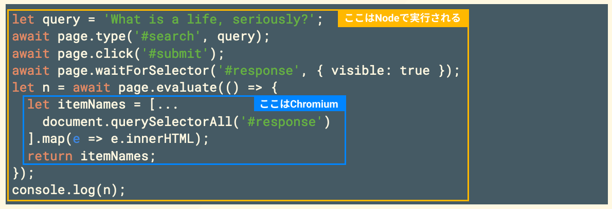
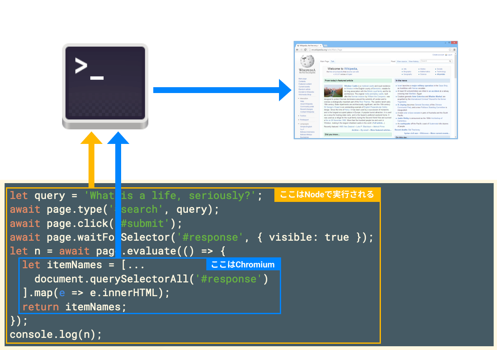

<!-- _class: lead gaia -->
# Puppeteer 難所攻略

2020年4月15日
[@tnzk / Kyohei Hamaguchi](https://twitter.com/tnzk)

---

## Puppeteer とは

- JavaScriptからChromeを制御するためのライブラリ
- Googleが開発してメンテしている
- E2Eテストなどの目的でよく使用されている

--- 

## Puppeteer の使い方

既存記事を参照のこと

---

## Puppeteer は難しい？

2つの意味で難しい

1. 非同期処理が難しい
2. Puppeteer独特のメンタルモデルが難しい

相互に全然関係ない話題なので、今回はこの2つをパートに分けて話します。

---
<!-- _class: lead gaia -->
# Part 1: 非同期処理が難しい
---

## 同期的/非同期的とは

- プログラムの基本は「逐次実行」＝同期処理
- 上から順に実行されていく
- 例（擬似コード）:

```
10 foo()
20 bar()
30 buzz()
```

foo→bar→buzzの順で完了する

--- 

## 逐次実行の例外

- 反復・条件分岐
- 割り込み
- 関数・サブルーチン・プロシージャ・メソッド
- 非同期処理

---

## 非同期処理のイメージ

```
10 foo() ← これが非同期処理だとする
20 bar()
30 buzz()
```

完了する順は、以下の3通り

1. foo→bar→buz
2. bar→foo→buz
3. bar→buz→foo

---

## つまり、

- 逐次実行→この実行が終わるまで、次の処理をしない
- 非同期処理→この実行を始めたら、実行が終わらなくてもすぐ次の処理を始める

---

## 何のために？

- 人間が快適に過ごすため
- 昔のコンピュータでは非同期処理が難しかったので、重い処理をしている間、人間はコンピュータで他のことができなかった
- CPUやメモリが少なかった時代はそれでよかった（どうせ他に何もできない）が、今は大抵の処理では計算リソースがあまる（例外: [動]画像処理、機械学習など）ので、もったいない
- あといろいろあって人類のほうが待つことができなくなった（待たなくて良いUXに慣れた、経済成長のため単位時間あたりの生産性を高める圧力がある、人類は堕落した、etc...）

---

## JavaScriptにおける非同期処理の書き方

1. `async/await`
2. `Promise`

---

## async を使った非同期処理の書き方

- 関数を定義するときに、`async`を付けると、その関数は非同期で実行"できる"関数みたいなものになる
- async関数と呼ぶ
- async関数は、普通に呼べば非同期に実行される

```
10 foo() ← これがasync関数だとする
20 bar()
30 buzz()
```

---

完了する順は、以下の3通り

1. foo→bar→buz
2. bar→foo→buz
3. bar→buz→foo

---

## await を使って async 関数を「待つ」

- async関数は、非同期で実行したくなければ、`await` を使って同期的に実行することもできる

```
10 await foo() ← これがasync関数だとする
20 bar()
30 buzz()
```

完了する順は、以下の1通り。なぜなら `await` で「待って」いるから。

foo→bar→buz

----

## Q: なぜ「待ちたい」ときと「待たなくていい」ときがあるのか？

- A: 気まぐれです（うそです）
- 非同期関数が返す値を使いたいとき→使いたいので、どれだけ時間がかかるとしても待つしかない
- 非同期関数に何かやってほしい（ファイルの保存など）が、返す値には興味がない→待たなくて大丈夫
- async関数だと、呼び出し側が都合に合わせて良い方を選べる

---

## いくつかの課題

- Q: 複数のasync関数を同時に実行して全員の終了を待ちたいときはどうすればいいの？
- Q: 待ちたくないけど、返す値を使って何かしたいときはどうしたらいいの？
- Q: （あといっこくらい何かほしい）

---

## A: Promiseを使う

- ちょっと難しくなるので、できればasync関数を使う感覚に慣れてから続きを読みましょう
- `async/await`とは別で、より細かく非同期処理を扱う方法

---

## Promiseとは？

- 約束。
- 普通の関数は値そのものを返すが、Promiseを使うと「値を返すという約束」を返すことができる。
  - 普通の関数: 値, 非同期関数: 値を返すという約束
  - 普通の関数: `value`, 非同期関数: `Promise.resolve(value)`

（ちなみにScalaだと同じような仕組みがFutureとして導入されている。約束に対して未来。なんとなくFutureのほうが無色透明な感じで個人的には好き）

---

## Promiseを返す関数

```js
let f = (x, y)=>{
  return Promise.resolve(x+y)
}
```

- こうすると`x`と`y`の和そのものではなく、和を返すという約束を返せる。
- 普通は返した頃には計算が終わっているので意味がないが、仮に`x`と`y`がとても大きい数で足し算に時間がかかる場合は、非同期にする意味がある

---

## Promise から値を取り出す

- 「値を返すという約束」は値そのものではないので、そのままは使えない
- 値を使って何かしたい場合、Promiseから値を取り出す必要がある
- 例えば、これはできない

```js
let p = f(1,2)
console.log(p * 2)
//=>NaN
```

---
- このようにして、Promiseが完了する（約束が果たされる）のを待つことができる

```js
(async ()=>{
  let q = await p
  console.log(q * 2)
})()
//=>6
```

---

## Q: 複数の非同期関数を待ちたい

- awaitでも順次やれば待てるが、並列実行できない。時間が無駄になる

```js
await f()
await g()
await h()
cont()
```

```
--f()-->
        --g()-->
                --h()-->
                        --cont()-->
```

---
- `Promise.all`は複数のPromiseを受け取り、そのすべてが完了するまで待ってくれる

```js
Promise.all([f(), g(), h()])
cont()
```

```
--f()-->
--g()-->
--h()-->
        --cont()-->
```

---

**三連await版**
```
--f()-->
        --g()-->
                --h()-->
                        --cont()-->
```
**Promise.all版**
```
--f()-->
--g()-->
--h()-->
        --cont()-->
```
:arrow_up:なんか速そう

---

## async関数＝Promiseを返す関数

- しれっと書いたが、実は`async/await`と`Promise`は混ぜて使うことができる
- というより、`async`キーワードは関数が返す値を`Promise`でくるむだけ
- `await`キーワードは、関数が返す`Promise`が実現するのを待つだけ

---

## Q: 待ちたくないが、Promiseが返す値を使いたい

- `Promise.then`を使う
- `Promise.then`に関数を渡すと、Promiseが完了したときにその関数を呼んでくれる

```js
let p = f()
p.then((value)=>{ console.log(value) })
```

---

## Part 1 まとめ

- 非同期処理は`async/await`か`Promise`を使って書く
- 待って値を使ったり、値を無視して待たずに進めたり、待たずに進めて値ができたら値を使ったりできる
- Puppeteerではブラウザの自動操作という時間のかかる場面がたくさん登場するので、非同期処理を使いこなすことがカギ
---
<!-- _class: lead gaia -->
# Part 2: Puppeteer独特のメンタルモデルが難しい
---

## Puppeteer の独特なところ

- 普通のプログラムは、書いたコードを実行したら、すべて手元で動作する
- Puppeteer では、手元のNode.jsが実行する箇所と、裏で起動してるHeadless Chromeが実行する箇所が混在する

---

## 例えばこんなコードで

```js
let query = 'What is a life, seriously?';
await page.type('#search', query);
await page.click('#submit');
await page.waitForSelector('#response', { visible: true });
let n = await page.evaluate(() => {
  let itemNames = [...
    document.querySelectorAll('#response')
  ].map(e => e.innerHTML);
  return itemNames;
});
console.log(n);
```

---



---



---

## 実行の流れ

- `evaluate` 関数に渡された関数は、Nodeを経由して、背後のChromiumに注入される
  - `Function.ToString` して文字列化して、 DevTools API の `Runtime.evaluate` で送り込んでいる
- Chromium は、注入されたコードを、開いているページの中で実行する
- このような状況を**実行コンテキストが違う**と言ったりする

---


---

## 普通、コンテキストは1つ

- プログラムは、基本的に一つの言語で書く
- サーバサイドやバックエンドで言語が違うときは、ファイルを分けるのが普通
- 1つのファイルに複数の言語が混在することはあまりない
  - 例外: インラインアセンブラ, JSX

---

## コンテキストの例

- 同じ関数でもコンテキストが異なれば別の結果になる
- 状態の抽象化

---

```js
class C {
  f() { return 2; }
  g(s) { return eval(s)() }
}
class D {
  f() { return 3; }
  g(s) { return eval(s)() }
}

let s = '() => this.f()';
let c = new C();
let d = new D();

c.g(s); //=> 2
d.g(s); //=> 3
```

---

## コンテキストの違いでエラーになる例

```js
class C {
  f() { return 2; }
  g(s) { return eval(s)() }
}
class D {
  noF() { return 3; }
  g(s) { return eval(s)() }
}

let s = '() => this.f()';
let c = new C();
let d = new D();

c.g(s); //=> 2
d.g(s); //=> Uncaught TypeError: this.f is not a function
```

---

## なぜエラーになったのか？

- `C#g()` と `D#g()` に渡した関数（を表す文字列）にはそれぞれ `f()` の呼び出しが含まれている
- クラス `C` にはあるが、 `D` にはない
- なので、 `eval` した時点でエラーになった
- `this.f()` は、 `C` のコンテキストにはあるが、 `D` のコンテキストにはない

---

## 「Webページ」という実行コンテキスト

- 処理系も違うし、ランタイムAPIも違う
- 動作しているプロセスも違う
- なので、青色の部分から、黄色の部分の変数にアクセスすることもできない。アクセスしょうとするとエラーになる

---

```js
let query = 'What is a life, seriously?';
let n = await page.evaluate(() => {
  alert(query); // <--- これはできない
});
```

こうしたいときは、こうする:

```js
let query = 'What is a life, seriously?';
let n = await page.evaluate((s) => {
  alert(s)
}, query);
```
こうすると、Puppeteerが関数と一緒に `query` もWebページの実行コンテキストに運んでいってくれる

---

## DOM要素の取得

- `page.$(selector)` で取得したDOM要素も、DOM要素そのものではなく `ElementHandle` で包まれている
- 取得したのはあくまで**Webページの実行コンテキスト**にあるオブジェクト
- それを**Nodeの実行コンテキスト**で使おうとしていることを意識する
- `ElementHandle`を介することによって、NodeとChromiumの間にあるややこしいアレコレをPuppeteerがよしなに片付けてくれる
- その代わりPuppeteerのお作法に合わせてあげよう

---

## まとめ

- Puppeteerはとても気軽に使えて便利
- 一方で、手軽なわりに前提となるメンタルモデルは結構複雑で独特
- 自分が今**Nodeで動くコードを書いているのか、Webページ上で動くコードを書いているのかを意識**することが大切
- そしてコードがその**境界を跨ごうとしているときは要注意**。あるいは変なエラーが出たときは、境界を跨ごうとしていないか確認する
  - 境界を跨ぐ方法は基本的に準備されているので安心してリファレンスを探そう

---

## おまけ

[ExecutionContext#evaluate](https://github.com/puppeteer/puppeteer/blob/main/src/common/ExecutionContext.ts#L278)より。`Function.ToString()`してる…

```js
let functionText = pageFunction.toString();
try {
  new Function('(' + functionText + ')');
  (snip)
}
let callFunctionOnPromise;
try {
  callFunctionOnPromise = this._client.send('Runtime.callFunctionOn', {
    functionDeclaration: functionText + '\n' + suffix + '\n',
    executionContextId: this._contextId,
...
```

---


<!-- 文化が違うなあと思った -->

---

- 前々から「どうやって送り込んでるんだろう？」とは思っていた
- 昔、ソフトウェアドライバで既存のプログラムに実行コードを注入するような仕事をしてた
- そのときは、あらかじめnasmで作ったバイト列を持っておいて、プログラムのロード時に割り込んで冒頭に差し込むようなことをしていた
- ＜図でも入れてみる＞

---

- 決して「ソースコード」ではない。コンパイルされたバイト列。この時点で既にプログラムは「自分がソースコードだったとき」のことは覚えていない
- なので、JSでも中間コードみたいなものを送り込むのだろうと想像していた
- そしたら `ToString` だった。衝撃……
- でも考えてみたらソースコードの状態のほうがポータブルなのは当然
  - しかしVSCodeはなぜあれを解釈できるのか謎。そのうちちゃんと調べたい

---

# 画像の出典

- https://commons.wikimedia.org/wiki/File:GNOME_Terminal_icon_2019.svg
- https://commons.wikimedia.org/wiki/File:Chromium_(web_browser).png
- https://alu.jp/series/%E3%83%92%E3%82%B9%E3%83%88%E3%83%AA%E3%82%A8/crop/DadKPetAw3VZt3wswh1H


